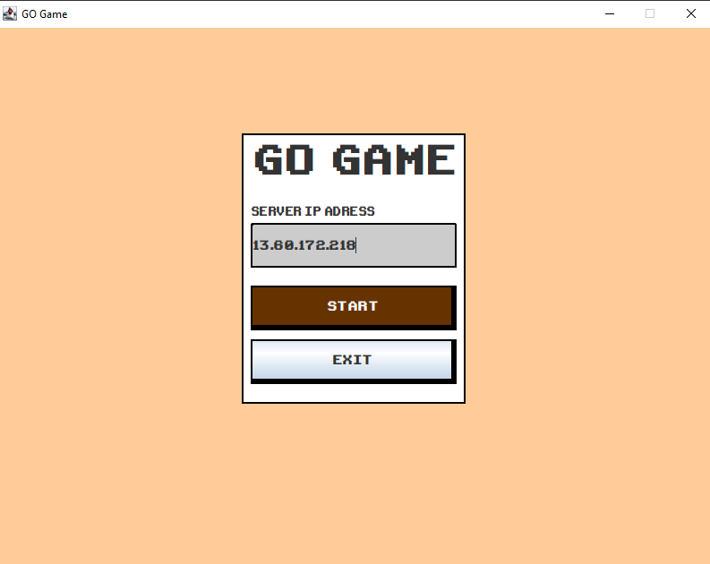
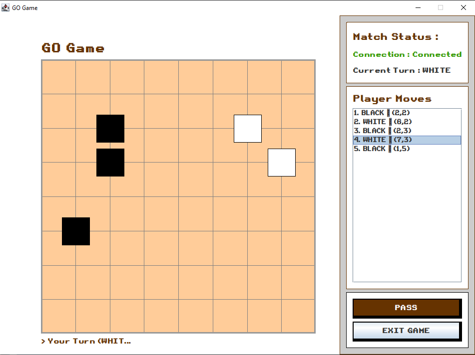
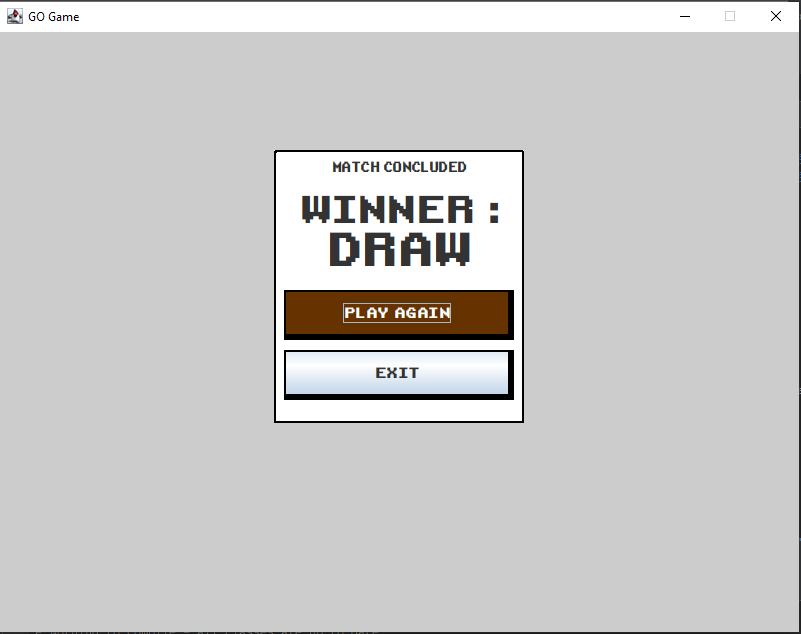
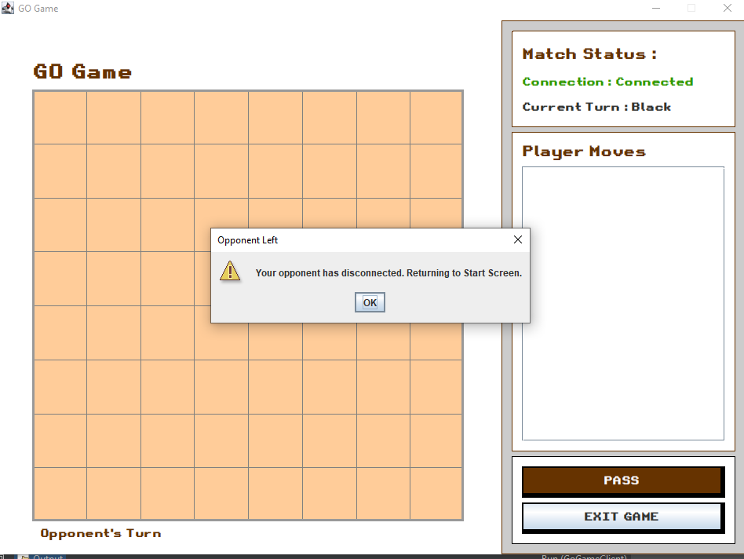
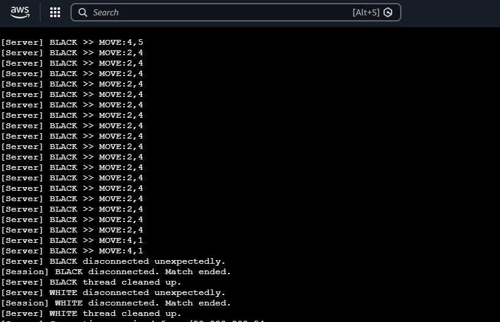

# Go Game — Multiplayer Network Board Game

A two-player implementation of the board game [Go](https://en.wikipedia.org/wiki/Go_(game)) built in Java, played over a TCP network. One player starts a server, two clients connect, and they play a full 9×9 Go match with rule enforcement, territory scoring, and rematch support — all through a retro-styled Swing GUI.

## Why This Exists

Go is one of the oldest board games in existence, but playing it over a network typically means relying on third-party platforms. This project is a self-contained client-server Go implementation where the server acts as the authority on game rules. Two players connect from separate machines (or the same machine), and the server validates every move, handles captures, prevents suicide, and scores territory when the game ends.

The networking layer uses raw TCP sockets with a plain-text protocol — no external game frameworks or libraries involved.

## Features

- **Networked multiplayer over TCP** — two clients connect to a central server, which pairs them into a game session automatically.
- **Server-authoritative rule enforcement** — the server validates every move. Clients cannot place stones out of turn, on occupied intersections, or in suicide positions.
- **Capture detection** — after every stone placement, the server runs a DFS liberty check on neighboring enemy groups and removes captured stones.
- **Suicide prevention** — if placing a stone would leave your own group with zero liberties (after captures are resolved), the move is rejected.
- **Chinese-style territory scoring** — when the game ends (two consecutive passes), the server counts each player's stones on the board plus any empty regions surrounded exclusively by that player's stones.
- **Concurrent sessions** — the server loops indefinitely, accepting new connections and pairing players. Multiple games can run simultaneously in separate threads.
- **Rematch voting** — after a game ends, both players can click "Play Again." When both agree, the server resets the board and starts a new game without reconnecting.
- **Disconnect handling** — if a player disconnects mid-game, the opponent is notified immediately and returned to the start screen. If a player disconnects while waiting in the lobby, the server cleans up and re-opens the slot.
- **Retro-styled GUI** — the client uses a custom TrueType pixel font (`Retro-Gaming.ttf`) applied recursively to all Swing components, plus custom hand-shaped cursor images that change depending on whose turn it is.
- **Move history panel** — every move and pass is logged in a sidebar list with move numbers, player colors, and coordinates.
- **Live score display** — territory scores are recalculated and displayed after every board update.

## Screenshots

### Start Screen
The connection lobby where players enter the server IP address and wait to be paired with an opponent.



### Gameplay
The main game board during an active match. The sidebar shows connection status, current turn, move history, and action buttons (Pass / Exit).



### End Screen
Displayed after two consecutive passes trigger game-over scoring. Shows the winner and offers rematch or exit.



### Waiting for Opponent Rematch
After clicking "Play Again," the client waits for the opponent to also accept.


### Opponent Disconnected
Dialog shown when the other player drops out of an active game.



### Server Log
Console output from the server running on an AWS EC2 instance, showing incoming connections, moves, and disconnections.



## Architecture

The project follows a client-server model with a clear separation between game logic, networking, and GUI.

```
┌─────────────────────┐       TCP (port 5000)       ┌─────────────────────┐
│   GoGameClient      │ ◄──────────────────────────► │   GoGameServer      │
│                     │                              │                     │
│  StartScreen        │      text-based protocol     │  GoServer           │
│  GameScreen         │  ◄──────────────────────────►│  ClientHandler (×2) │
│  EndScreen          │                              │  GameSession        │
│  NetworkClient      │                              │  GameLogic          │
│  GameLogic (render) │                              │  (authoritative)    │
│  FontUtil           │                              │                     │
└─────────────────────┘                              └─────────────────────┘
```

**Server side:**
- `GoServer` — opens a `ServerSocket` on port 5000 and runs an infinite accept loop. The first client to connect is assigned BLACK and waits in the lobby. The second client gets WHITE, and a `GameSession` is created for the pair.
- `ClientHandler` — one per connected player, runs on its own thread. Reads lines from the socket (`MOVE:r,c`, `PASS`, `RESTART_REQ`) and forwards them to the `GameSession`.
- `GameSession` — holds the authoritative `GameLogic` instance. All public methods are `synchronized` to prevent race conditions between the two `ClientHandler` threads. Validates moves, applies captures, tracks consecutive passes, computes scores, and broadcasts state to both clients.

**Client side:**
- `GoGameClient` — the `main()` entry point. Launches `StartScreen` on the Swing EDT.
- `StartScreen` — takes a server IP, opens a TCP connection via `NetworkClient`, and waits for the `GAME_STARTED` signal.
- `GameScreen` — renders the 9×9 board by overriding `paintComponent`. Converts mouse clicks to grid coordinates and sends `MOVE:r,c` to the server. Maintains a local `GameLogic` instance used only for rendering — the server's board state (received via `UPDATE:` messages) is the source of truth.
- `EndScreen` — displays the winner and handles rematch voting.
- `NetworkClient` — manages the TCP socket and runs a background listener thread. Parses incoming server messages and dispatches them to whichever screen is currently active via the `ServerMessageListener` interface (Observer pattern).
- `GameLogic` — contains all Go rules: liberty checking (DFS), group removal, capture detection, suicide validation, board serialization/deserialization, and territory scoring (flood-fill). Shared between client and server as a dependency.
- `FontUtil` — loads `Retro-Gaming.ttf` from disk and recursively applies it to every component in a Swing container.

**Data flow for a single move:**

```
Player clicks board → handleClick() → networkClient.sendMove(r, c) → "MOVE:r,c" over TCP
    → ClientHandler.run() reads line → session.handleMove(handler, r, c)
    → game.placeStone(r, c, player) → checkCaptures() → hasLiberty() suicide check
    → broadcast("MOVE_OK:r,c,COLOR") + broadcast("UPDATE:<81 chars>") + broadcast("TURN:...")
    → NetworkClient.listenLoop() → parseAndDispatch() → GameScreenListener.onBoardUpdate()
    → game.deserializeBoard(data) → jPanel_Board.repaint()
```

## Project Structure

```
.
├── GoGameClient/                   # Client module (Swing GUI + networking)
│   ├── pom.xml                     # Maven config — depends on AbsoluteLayout (NetBeans)
│   ├── resources/
│   │   ├── fonts/
│   │   │   └── Retro-Gaming.ttf    # Custom pixel font for the retro look
│   │   └── images/
│   │       ├── GoGameIcon.ico      # Application icon
│   │       ├── hand_black.png      # Custom cursor — black stone in hand
│   │       ├── hand_white.png      # Custom cursor — white stone in hand
│   │       └── hand_empty.png      # Custom cursor — empty hand (opponent's turn)
│   └── src/main/java/com/mycompany/gogameclient/
│       ├── GoGameClient.java       # Entry point — launches StartScreen on EDT
│       ├── StartScreen.java        # Connection lobby (IP input, waiting state)
│       ├── GameScreen.java         # Main game board, move handling, side panel
│       ├── EndScreen.java          # Winner display, rematch voting
│       ├── NetworkClient.java      # TCP socket management, message parsing
│       ├── GameLogic.java          # Go rules engine (shared with server)
│       ├── FontUtil.java           # Custom font loader and applicator
│       ├── StartScreen.form        # NetBeans GUI designer layout file
│       ├── GameScreen.form         # NetBeans GUI designer layout file
│       └── EndScreen.form          # NetBeans GUI designer layout file
│
├── GoGameServer/                   # Server module (headless, console-only)
│   ├── pom.xml                     # Maven config — depends on GoGameClient for GameLogic
│   └── src/main/java/com/mycompany/gogameserver/
│       ├── GoServer.java           # Entry point — ServerSocket accept loop
│       ├── ClientHandler.java      # Per-player thread, reads client commands
│       └── GameSession.java        # Game state, move validation, scoring
│
├── Screenshots/                    # Application screenshots
│   ├── StartScreen.PNG
│   ├── Gameplay.PNG
│   ├── EndScreen.PNG
│   ├── WaitingForOpponentReplay.PNG
│   ├── OpponentDisconnected.PNG
│   └── ServerLog.PNG
│
├── README.md
├── ARCHITECTURE.md
├── INSTALLATION.md
├── PROJECT_STRUCTURE.md
├── USER_GUIDE.md
├── CONTRIBUTING.md
├── REPOSITORY_REVIEW.md
├── project_report.pdf              # Project report document
└── .gitignore
```

## Technologies

| Category     | Technology                                                                   |
|--------------|------------------------------------------------------------------------------|
| Language     | Java 17                                                                      |
| Build tool   | Apache Maven 3.x                                                            |
| GUI          | Java Swing (with NetBeans AbsoluteLayout library for form-designed screens)  |
| Networking   | Java `java.net.Socket` / `ServerSocket` — raw TCP with text-line protocol    |
| IDE support  | NetBeans GUI Designer (`.form` files for StartScreen, GameScreen, EndScreen) |
| Font         | Custom TrueType font (`Retro-Gaming.ttf`)                                   |
| Deployment   | Tested on AWS EC2 (server), local machines (clients)                         |

No databases, no external web frameworks, no third-party game engines. The only external dependency is `org.netbeans.external:AbsoluteLayout` for the form-based layout manager.

## Installation

See [INSTALLATION.md](INSTALLATION.md) for detailed step-by-step instructions.

**Quick start:**

```bash
# Prerequisites: Java 17+, Maven 3.x

# 1. Build the client first (server depends on it)
cd GoGameClient
mvn clean install

# 2. Build the server
cd ../GoGameServer
mvn clean package

# 3. Start the server
java -cp target/GoGameServer-1.0-SNAPSHOT-jar-with-dependencies.jar com.mycompany.gogameserver.GoServer

# 4. Start two client instances (separate terminals)
cd ../GoGameClient
mvn exec:java
```

## Usage

See [USER_GUIDE.md](USER_GUIDE.md) for a detailed walkthrough.

**Short version:**

1. Start the server on any machine.
2. Launch two client instances (same machine or different machines on the same network).
3. In each client, enter the server's IP address (use `127.0.0.1` for local play) and click **START**.
4. The first player to connect gets BLACK and waits. When the second player connects, the game begins.
5. Black moves first. Click an intersection on the board to place a stone. Use the **PASS** button to skip your turn.
6. Two consecutive passes end the game. The server scores territory and announces the winner.
7. After the game, click **PLAY AGAIN** to rematch (both players must agree) or **EXIT** to disconnect.

## Networking Protocol

Client and server communicate over TCP using newline-delimited plain text. No binary framing, no JSON — just simple string commands.

### Server → Client

| Message                    | Meaning                                                              |
|----------------------------|----------------------------------------------------------------------|
| `WELCOME:BLACK`            | Assigns the player color BLACK                                       |
| `WELCOME:WHITE`            | Assigns the player color WHITE                                       |
| `MESSAGE:<text>`           | Generic status text (e.g., "Waiting for opponent...")                 |
| `GAME_STARTED`             | Both players connected, game is live                                 |
| `UPDATE:<81-char-string>`  | Full board state, row-major order: `0`=empty, `1`=black, `2`=white   |
| `TURN:BLACK` / `TURN:WHITE`| Indicates whose turn it is                                           |
| `MOVE_OK:<r>,<c>,<COLOR>`  | Confirms a valid move for the history log                            |
| `PASS_OK:<COLOR>`          | Confirms a pass for the history log                                  |
| `INVALID_MOVE`             | The attempted move was rejected (occupied, suicide, wrong turn)      |
| `GAME_OVER:<WINNER>`       | Game ended — winner is `BLACK`, `WHITE`, or `DRAW`                   |
| `OPPONENT_DISCONNECTED`    | The other player left                                                |

### Client → Server

| Message          | Meaning                              |
|------------------|--------------------------------------|
| `MOVE:<r>,<c>`   | Request to place a stone at (r, c)   |
| `PASS`           | Pass this turn                       |
| `RESTART_REQ`    | Request a rematch after game over    |

### Board Serialization

The board is sent as an 81-character string (9×9 = 81). Each character represents one intersection in row-major order:
- `'0'` = empty
- `'1'` = black stone
- `'2'` = white stone

For example, a completely empty board is `"000000000000000000000000000000000000000000000000000000000000000000000000000000000"`.

## Configuration

The project uses hardcoded configuration values — there are no external config files:

| Parameter      | Value   | Location                              |
|----------------|---------|---------------------------------------|
| Server port    | `5000`  | `GoServer.java` (`PORT` constant)     |
| Board size     | `9×9`   | `GameLogic.java` (`SIZE` constant)    |
| Default IP     | varies  | `StartScreen.java` (text field value) |

To change the port, edit the `PORT` constant in `GoServer.java` and the corresponding port number in `StartScreen.java` (line 155, `new NetworkClient(ip, 5000)`).

## Deployment

The server is a headless Java application that can run on any machine with Java 17+. Based on the server log screenshot, it has been tested on AWS EC2.

**To deploy the server on a remote machine:**

1. Build the fat JAR:
   ```bash
   cd GoGameServer
   mvn clean package
   ```
2. Upload `GoGameServer-1.0-SNAPSHOT-jar-with-dependencies.jar` to the server.
3. Run it:
   ```bash
   java -jar GoGameServer-1.0-SNAPSHOT-jar-with-dependencies.jar
   ```
4. Make sure port 5000 is open in the firewall / security group.
5. Clients connect using the server's public IP address.

The client runs locally on each player's machine. It requires a graphical environment (desktop OS) since it uses Swing.

## Future Improvements

These are realistic additions based on what the current codebase already supports:

- **Ko rule** — the current implementation does not enforce the ko rule (repeating a board position). This would require storing the previous board state and comparing after each move.
- **Configurable board size** — the board is fixed at 9×9. Supporting 13×13 and 19×19 would require parameterizing `GameLogic.SIZE`, adjusting the serialization length, and making the GUI scale the grid dynamically.
- **In-game chat** — the protocol already has a `MESSAGE:` command. Adding `CHAT:<text>` from client to server and `MESSAGE:<player>:<text>` broadcasts would be straightforward.
- **Spectator mode** — allow additional clients to connect to an active session as read-only observers who receive board updates but cannot send moves.
- **Game history / replay** — save the sequence of moves to a file, allowing games to be replayed or reviewed.
- **Komi (handicap scoring)** — add a 6.5-point komi for WHITE to compensate for BLACK's first-move advantage, which is standard in competitive Go.
- **Circle-shaped stones** — stones are currently drawn as filled rectangles (`fillRect`). Switching to `fillOval` would look closer to a traditional Go board.
- **Sound effects** — play a stone-click sound on valid moves and a notification sound on opponent's turn.
- **Connection timeout** — the client currently hangs if the server is unreachable. Adding a socket timeout would let it fail gracefully.

## Contributors

- **Abdelfatah Alhoot** — full implementation (client, server, game logic, UI design)

## License

No license file was found in the repository. All rights are reserved by the author by default. If you intend to make this project open-source, consider adding an [MIT](https://choosealicense.com/licenses/mit/) or [Apache 2.0](https://choosealicense.com/licenses/apache-2.0/) license file.
